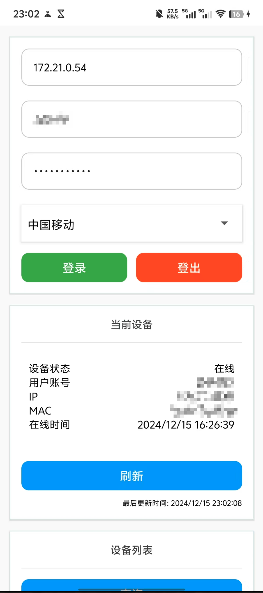

# TJ-DORM-WIFI-Helper React-Native

同济大学天骄公寓校园网连接助手

理论上 `TJ-DORM-WIFI` 都可以用

基于 React-Native 开发，所以支持安卓和 iOS

> 我没有 iOS 设备，只打包了 `apk` 文件，iOS 设备可以自行编译

# 功能

1. 缓存账号和密码，可以一键登录

2. 查询当前设备的联网状态

3. 查询当前账号的登录设备信息（IP 地址、Mac 地址、联网时间等）

# 演示



# 使用

## 直接下载

[点击下载 apk](https://github.com/sitdownkevin/TJ-DORM-WIFI-Mobile/releases/download/1.0.0/TJ-DORM-WIFI-Helper.apk)

## 从源码构建

1. 安装需要的 package

```
npm install
```

2. 构建应用

对于安卓

```
npm run build
```

打包好的 `.apk` 文件会出现在项目根目录